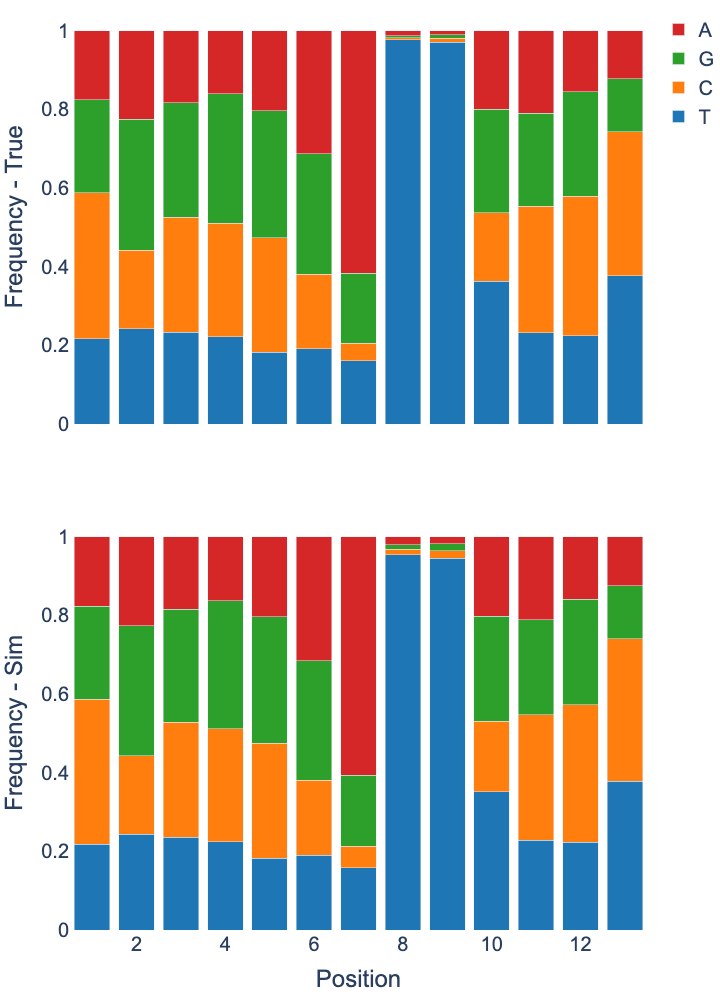

# Boquila example usage

## Requirements

- Preferably macOS, Linux, or another Unix-like OS (tested on Ubuntu and macOS)
- [Rust installation](https://www.rust-lang.org/)
    - For installing boquila and later calculating nucleotide profiles of our results
- [Cutadapt](https://cutadapt.readthedocs.io/en/stable/installation.html)
- Python installation and following packages
    - `plotly=5.3.1`
    - `pingoin=0.4.0`
    - `pandas=1.2.3`


## Raw Data

We are using Escherichia coli XR-seq data from [Adebali,O. et al. (2017)](https://doi.org/10.1073/pnas.1700230114)

- XR-seq data can be downloaded from [here](ftp://ftp.sra.ebi.ac.uk/vol1/fastq/SRR512/007/SRR5125157/SRR5125157.fastq.gz)

- Escherichia coli reference genome can be downloaded from [here](https://www.ncbi.nlm.nih.gov/nuccore/NC_000913.3?report=fasta) *save as `ecoli_genome.fasta`*

## Install Boquila

There are two methods

> Both methods require Cargo the Rust package manager, which should be installed automatically while installing Rust

1. Installing with `cargo`
    *Cargo will build and install the binary, by default to `$HOME/.cargo/bin/`*

    ```bash
    cargo install --branch main --git https://github.com/CompGenomeLab/boquila.git
    ```

2. Building from source
    *For convenience, you can copy the executable `./target/release/boquila` to some directory in your `PATH`.*

    - Clone the repository
        ```bash
        git clone https://github.com/CompGenomeLab/boquila.git
        ```
    - Then build with `cargo`
        ```bash
        cd boquila
        cargo build --release
        ./target/release/boquila --version
        0.5.1
        ```

## Preparing Data

1. We need to trim reads to remove adapter sequences, for that we'll be using `cutadapt`

    ```bash
    cutadapt -a TGGAATTCTCGGGTGCCAAGGAACTCCAGTNNNNNNACGATCTCGTATGCCGTCTTCTGCTTG -o SRR5125157_cutadapt.fastq SRR5125157.fastq
    ```

2. **(_Optional)_** We need to create regions file to tell boquila which parts of the genome should be used while simulating reads.
We will be using whole genome.

> Regions file for this tuttorial is already available at [here](./ecoli.ron)

- We can use `awk` to get chromosomes and their length from reference genome.
    ```bash
    awk '/^>/ {if (seqlen){print seqlen}; print ;seqlen=0;next; } { seqlen += length($0)}END{print seqlen}' ecoli_genome.fasta
    ```
    then create `.ron`formatted file with the results, example file can be found [here](../GRCh38.ron)

## Run Boquila

We can use following command to run simulation

```bash
boquila SRR5125157_cutadapt.fastq --ref ecoli_genome.fasta --regions ecoli.ron --seed 7 > SRR5125157_sim.fastq
```

## Profile Plots and Statistical Analysis

We can use `nuc_profile` utility in boquila to quickly get profiles of our files.

- We need to clone the repository and compile `nuc_profile`

    1. Clone the `boquila` repository if you didn't previously.
        ```bash
        git clone https://github.com/CompGenomeLab/boquila.git
        ```
    2. Build `nuc_profile`
        ```bash
        cd boquila/examples/nuc_profile
        cargo build --release
        ```
        Binary will be available at `boquila/examples/nuc_profile/target/release/`
        *Again for convenience, you can copy the executable `boquila/examples/nuc_profile/target/release/nuc_profile` to some directory in your `PATH`.*

- Run the profiler for both files

```bash
nuc_profile -R SRR5125157_cutadapt.fastq --len 13 > input_profile.tsv
nuc_profile -R SRR5125157_sim.fastq --len 13 > simulation_profile.tsv
```

- For plots and statistical analysis you can use [this](./plots.ipynb) python notebook provided in the examples directory

- After completing steps in notebook provided above, you should see following plots.

<p align="center">

</p>
